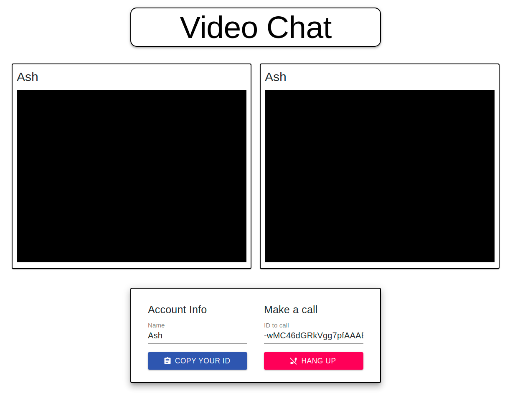

# Video Chat

## Deployed Link: https://video-chat-ab.netlify.app/

## Technology

- React
- Nodejs
- Express
- Socket.io

## Installation

- Fork/Clone or Download Zip
- Run npm install in root and client directories
- run npm start in root and client directories

## User Stories

- As a user I would like to be able to see and hear who I am communicating with.
- As a user I would like to be able to deciede to answer or ignore a call.
- As a user I would like to be able to hang up when I want to end the call.
